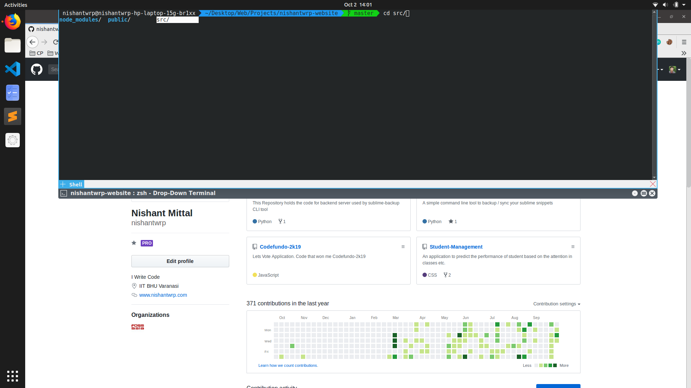

# Yakuake + oh-my-zsh + agnoster
> Getting bored of the default terminal in ubuntu, I decided to change my terminal and came up with this.

----
### Instructions to set up this terminal

#### Install zsh
  - `sudo apt install zsh`

#### Make zsh your default terminal
- `chsh -s $(which zsh)`
-  Now logout and login of the current user and run `echo $SHELL`
- It should show zsh

Note: Choose option (2) of the many options which appear on first time launch of zsh

#### Install oh-my-zsh
- `sh -c "$(curl -fsSL https://raw.githubusercontent.com/robbyrussell/oh-my-zsh/master/tools/install.sh)"`

#### Changing theme to agnoster

- Change default theme in ~/.zshrc file to agnoster

Note: If the agnoster theme doesn't appear correctly. Run this command to install powerline fonts

- `sudo apt-get install fonts-powerline`

#### Installing Yakuake
- `sudo apt-get install yakuake`

Now you are all setup.

Note: If you want Yakuake terminal to get activated automatically, you can add it to startup applications.

### References
- [https://kifarunix.com/how-to-install-and-setup-zsh-and-oh-my-zsh-on-ubuntu-18-04/](https://kifarunix.com/how-to-install-and-setup-zsh-and-oh-my-zsh-on-ubuntu-18-04/)
- [https://github.com/powerline/fonts](https://github.com/powerline/fonts)
- [https://williamarchibaldspooner.wordpress.com/2011/03/27/install-yakuake-ubuntu-installation-and-set-up-guide/](https://williamarchibaldspooner.wordpress.com/2011/03/27/install-yakuake-ubuntu-installation-and-set-up-guide/)
 